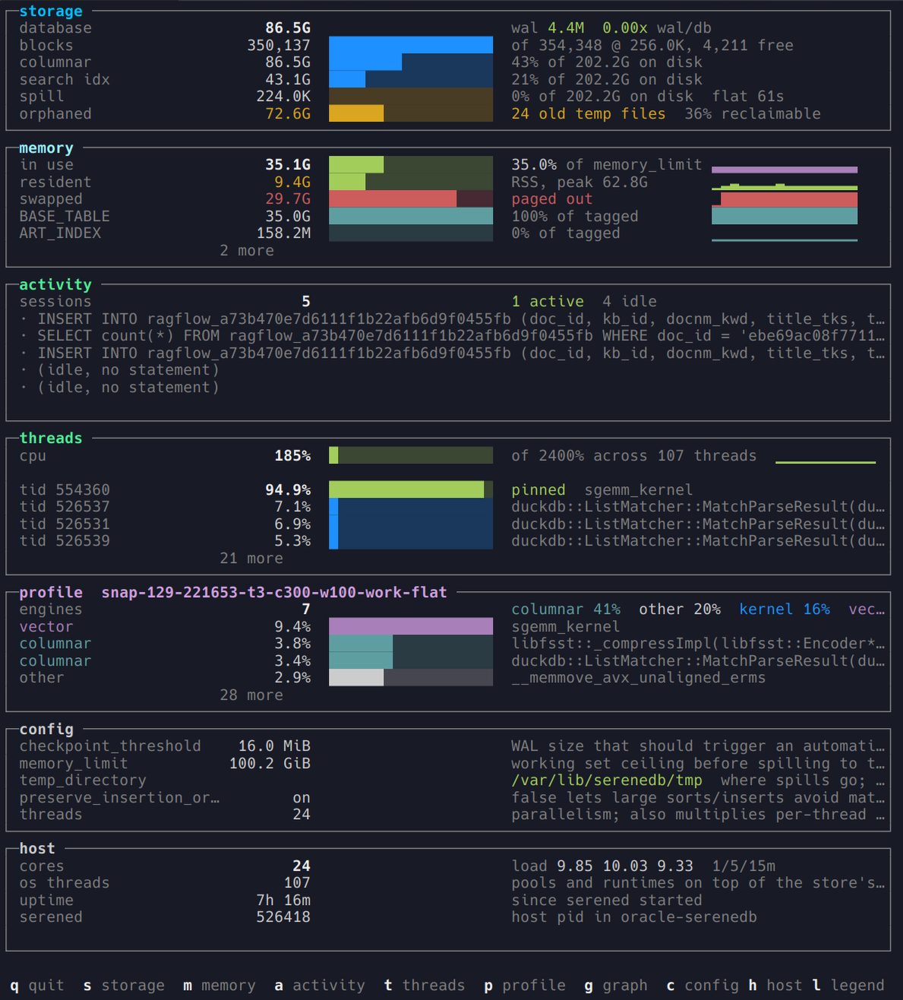
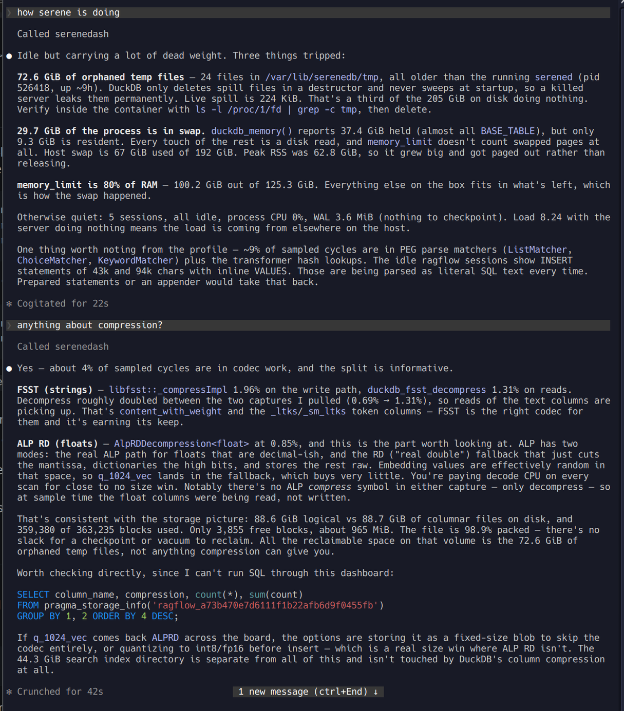
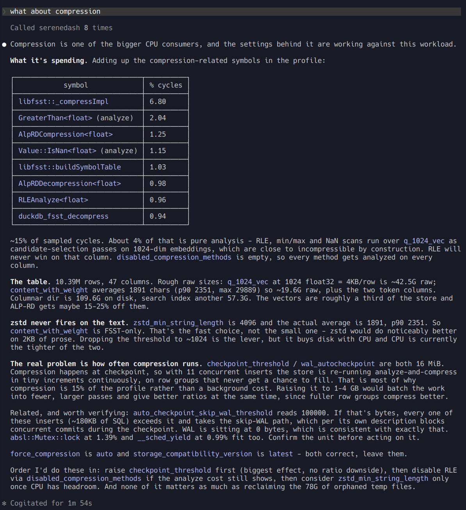

# serenedash

Live terminal dashboard for a SereneDB server, and the same collectors over MCP.

    pip install -e .              # or: pip install -e ".[mcp]" for the MCP server

    serenedash                    refresh every 5s
    serenedash --once             one frame (scripts, logs)
    serenedash --once --format json   the same snapshot the MCP server returns
    serenedash --print-config     resolved settings, and which layer each came from

Credentials are optional. Without them the threads, profile and host panels are live, the storage
directory sizes and the process's resident and paged-out memory are live — all of that is /proc, du
and perf captures — and the panels that genuinely need the server say which of "no driver", "no
credentials" or "cannot connect" applies, and how to fix it. Nothing is drawn off an empty result:
`sessions 0` above `nothing running` would be a false panel, not a degraded one.

Configuration is layered: flag > environment > config file > default. Nothing about a particular
deployment is compiled in — see `serenedash.toml.example` and `.envrc.example`, and `--print-config`
when you want to know which layer won. It reaches the server with psycopg over TCP whether serened
runs in a container here, as a process here, or on another host (`target = docker | local | remote`).

Every panel has a view behind it, keyed by its own name, and every view is a toggle:

`q` quit · `s` storage · `m` memory · `a` activity · `t` threads · `p` profile · `g` call graph ·
`c` config · `h` host · `i` search · `d` doctor · `l` legend · `x` mouse · `j`/`k` scroll

`l` documents every label and number on the screen; `d` checks every precondition for a full
picture and tells you what each missing one costs you. Those two are the place to look first.

Point at anything and it says what it is — the same text `l` carries, looked up by where the
pointer is instead of read top to bottom, so a bar answers for its own row and a word in a tail
answers from its own panel. Clicking a panel opens its view and the wheel scrolls. Esc leaves
whatever you actually navigated into, and only dismisses a tooltip when there is nothing else to
leave — a tooltip appears because the pointer is somewhere, not because you opened it, so it should
not cost a keypress. It also expires on its own after two refreshes, because the protocol has no
"pointer left the window" event to hang it on. `x` turns tracking off for a moment
— while it is on the terminal's own text selection is off (Shift usually bypasses it) — and
`mouse = false` or `SERENEDASH_MOUSE=0` turns it off for good.

## Planning a statement that is already running

On the activity view: `enter` opens a statement, then `e` plans it and `e` again puts the text
back. Same keys in the browser.

`EXPLAIN` has always been something you could type. What you could not do is aim it at the
statement currently burning a core: its text is in `pg_stat_activity` rather than in front of
you, and on this deployment it is 68 KB, so getting it into a psql session means fetching it and
quoting it back. This is one keypress on the row. `EXPLAIN` does not execute, so it is safe to
point at something hung — 6 ms against a statement that had been spinning for twenty minutes.

The plan is drawn unwrapped, because DuckDB's box alignment *is* the tree, and it says when a
row was too wide to fit rather than folding it into confetti. Moving the cursor drops the plan:
a plan left under a different statement is not stale decoration, it is the wrong answer under
the right heading.

## Panels

| panel | answers |
|---|---|
| storage | database vs WAL size, and the **ratio** — a WAL several times the database means checkpointing has stalled, not that the WAL is big. Temp files older than the process are counted as `orphaned`, not as spill |
| memory | `duckdb_memory()` by pool with a history trace each, plus RSS and **swap** — a store reporting 34 GB of buffers while 30 GB of it is paged out looks fine until you see that row |
| activity | live query text from `pg_stat_activity`; **and** it says so when nothing is running, because a pinned core with no session is orphaned server-side work. `enter` opens a statement whole, `e` plans it — see below |
| threads | total process CPU against every core, then the threads carrying it. 100% of one core reads as 4% at process level and as a pinned thread here. Rows are identified by tid — 103 of serened's 107 threads inherit the process name |
| profile | sampled symbols by engine over a sliding window of captures, joined per thread so a row says what it is running |
| search | the inverted indexes: segments, live against deleted documents, buffered writes not yet searchable, and how long commits and consolidations are taking. A rising pending queue is maintenance falling behind the write rate |
| host | cores, load, RAM, swap, and `memory_limit` as a share of the machine — the context every other number is read against |
| config | the settings with measured consequences, each predicate evaluated against the live server. `c` opens all 297 with the server's own descriptions |

Every bar and its history share one denominator, and each panel says what that denominator is. A
thread bar is a share of one core; storage shares add to 100 against the on-disk total; a memory
sparkline is its own bar over time.

## Anomalies

Everything else here compares against a threshold somebody chose — WAL over 1x the database,
memory_limit over 75% of RAM. Those cannot catch a pool that has been climbing all afternoon, which
is not over any limit until it is. So each series is also judged against **its own recent past**:

| rule | shape | example |
|---|---|---|
| `spike` | one sample far from the window behind it | a query allocates 22 GB and gives it back |
| `step up` / `step down` | the recent quarter sits at a different level from everything before it | RSS moves and stays moved |
| `climbing` | materially higher than it started, in many small increments | the leak shape — something is not being released |

The baseline is a median and the spread a median absolute deviation, not a mean and a standard
deviation. Both are computed over a window that *contains* the event being looked for: a mean is
dragged toward a spike and a standard deviation inflated by it, so a large enough excursion raises
the bar enough to hide itself. The median pair survives up to half the window being the event.

A detected row gets a coloured label on the main frame — that is all the space there is — and `m`,
the tooltip and the MCP `findings` carry what was measured, what was expected, and over how long.
Samples are also written to `<perf_dir>/history.jsonl` as the dashboard runs, so the baseline
outlives a restart and the MCP server (a different process, one instant per call) has something to
judge against. Under 24 samples nothing speaks, and it says that rather than reporting all clear.

## MCP

`serenedash-mcp` exposes the same collectors as MCP tools, so an agent can read the server's
state instead of being shown a screenshot of it.

That is one `status()` call. The tools return numbers next to the denominators they were measured
against and findings that carry the evidence for themselves, so the answer can be checked rather
than believed — "72.6 GiB of orphaned temp files" arrives with the file count, the reason DuckDB
leaks them, the live-spill figure it is *not* to be confused with, and the command to confirm
nothing holds them open.

    pip install -e ".[mcp]"
    serenedash-mcp                 # read-only
    serenedash-mcp --allow-write   # also exposes set_setting

For Claude Code, from the directory you start it in:

    claude mcp add serenedash -- /path/to/.venv/bin/serenedash-mcp

Tools: `status` `storage` `memory` `activity` `search` `threads` `profile` `callgraph` `host`
`config` `query` `explain` `anomalies`, plus `set_setting` under `--allow-write`. `explain` takes
a `pid` as well as `sql`, for the same reason the `e` key exists. `status` is one round trip and leads
with `findings` — each one a condition that was measured, with the numbers behind it and how to
check it, rather than a verdict to be taken on trust. Same environment variables as the dashboard
(`SERENEDB_CONTAINER`, `PGPASSWORD`, `SERENEDASH_PERF_DIR`, …), and the same snapshot builder as
`--format json`, so the two cannot disagree about what a snapshot contains.

The server ships `src/serenedash/instructions.md`, which the client injects as context before the
model calls anything: how to read the numbers, the vocabulary that is easy to misread, how to reason
about what you are seeing, and a knowledge base on the mechanics behind it — row groups and zonemaps,
why compression frequency is a checkpoint setting, what does and does not spill, ART indexes sitting
outside the buffer manager, inverted-index refresh and consolidation, IVF training versus search,
`/proc` accounting, perf build-ids. Each section ends with what the mechanic means for reading a
live server, and the examples are ones this deployment produced.

It also points at the three system tables no panel exposes — `sdb_metrics` (segment counts, buffered
docs, refresh and consolidation backlogs, per-index size), `sdb_settings` (the server's own thread
pools and connection limits, which `duckdb_settings()` does not contain) and `sdb_progress` (how far
along a running query is). That is most of what `query` is for.

Instructions are injected **once**, at connect time, and held for the session — so an upgrade
mid-session leaves an agent reasoning from documentation that no longer describes the server. Every
tool result therefore carries `server: {version, instructions_revision, instructions_uri}`, and the
document is stamped with the revision it was built from. When the two disagree the agent is told to
re-read `serenedash://instructions` (a resource, so no reconnect is needed) and to say so out loud.

`query` runs **one read-only statement** and returns the rows. The panels answer the questions they
were built for; this is for the ones they were not, and without it the honest move on a question the
panels do not cover is to write the SQL out and ask someone else to run it — a diagnosis that stops
halfway. Three independent bounds: the statement's leading keyword must be one that cannot write
(an allowlist, checked before any connection is opened, and it sees through comments and brackets),
no semicolon batches, and the connection is opened read-only regardless — so the server would reject
a write that got past the check. Results are capped by rows and then by characters.

This is the difference it makes. The question is "what about compression":

The profile panel on its own gets to "columnar is 44% of sampled cycles" and stops. Everything past
that needed the database: the table is 10.39M rows over 47 columns, `content_with_weight` averages
1891 characters against a `zstd_min_string_length` of 4096 - so zstd never fires and the column is
FSST-only - and `checkpoint_threshold` is 16 MiB with 11 concurrent inserts, so the store is
re-running analyze-and-compress continuously on row groups that never get a chance to fill.

That last one is the finding, and it inverts the obvious fix. The question sounds like a choice of
codec. The answer is how often the work runs, which is a checkpoint setting. No panel was going to
show that, because it is a join across a profile, one column's length distribution and two settings.
Eight tool calls, and not one of them a request for the user to go and run something.

Rates arrive next to their base — `{"cpu_percent_of_one_core": 94.9, "cores": 24}`, storage shares
with the total they divide. Every display bug this dashboard has had was a unit error rather than a
collection error, and a bare number in JSON is exactly as easy to misread as a bare number on screen.

## perf

The dashboard cannot record: `perf_event_paranoid` blocks attaching to a container process without
root, and running the whole tool as root to get one panel is a bad trade. So `perf-snap.sh` ships
alongside it and does the recording under sudo:

    sudo ./perf-snap.sh --container oracle-serenedb --window 100 --every 900

`--every N` replaces a manual `perf record ... -- sleep N` loop; phase detection replaces a one-shot
catch-and-exit script, and re-arms. After each capture it signals the dashboard (`SIGUSR1` via a pid
file in the perf directory) so new data appears immediately. The dashboard rescans every tick anyway
— the signal only removes the latency, so an older perf-snap still works.

Symbols resolve for an **unprivileged** reader only if the matching binary is registered by build-id:

    perf buildid-cache --add /path/to/the/serened that matches this build

Without it, perf can name symbols only for a reader that can reach the binary through
`/proc/<pid>/root` — which is root — so perf-snap's own summaries have names while the dashboard
shows raw addresses. The `profile` panel prints the command when it detects that. A new build is a
new build-id, so this is per-build. Kernel *symbols* additionally need
`sysctl kernel.kptr_restrict=0`; without it they stay as addresses and the engine split still works.
